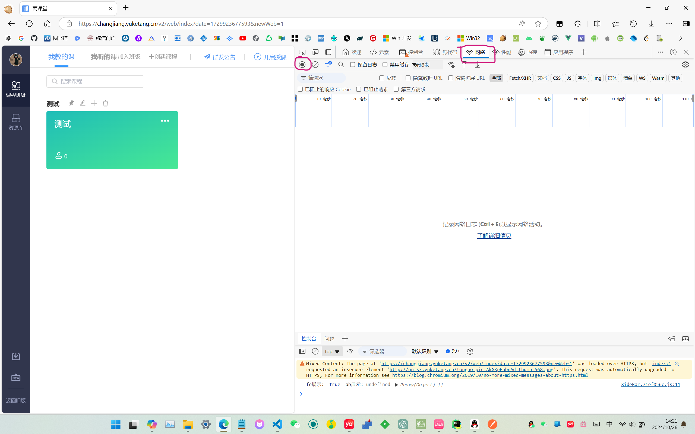
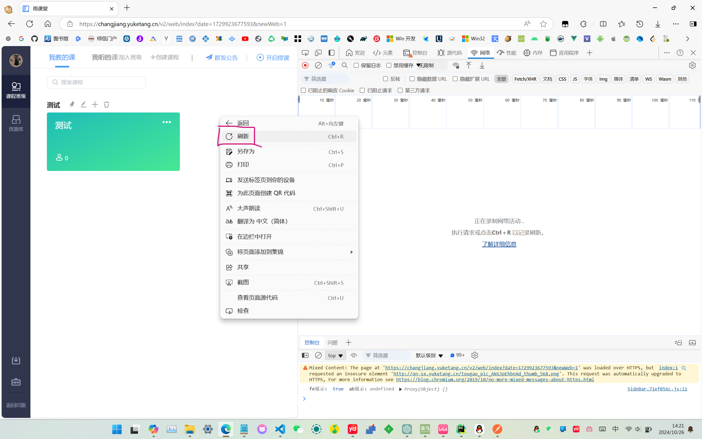
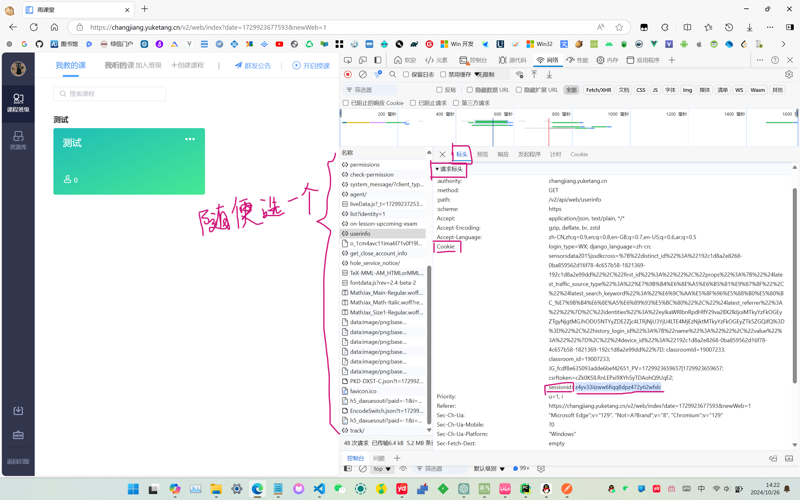
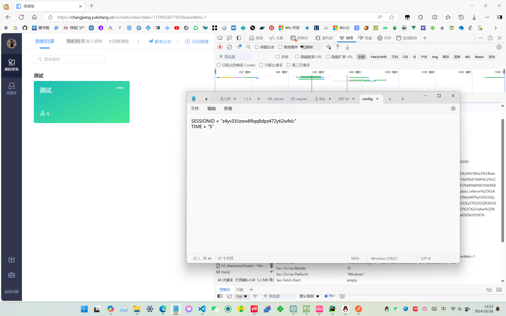

# 雨课堂定时签到
## 食用方法
### 1.打开config.txt,填写SESSIONID
     目前没做登录，需要自行抓包请求头Cookie获取，设备太多容易掉线
#### 获取方式
访问 https://changjiang.yuketang.cn/ ,登录后，按F12

复制粘贴得到的id到config.txt，并保存即可
### 2.定时运行start.py即可
     最简单方法：服务器部署宝塔面板-计划任务
     最低成本方法：或者应用Github Actions定时执行
### 3.可查看日志log.json查看签到内容，如果已经签到过不再写入